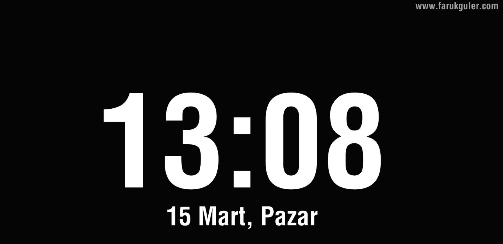

# OpenFliglo - Profesyonel Ekran Koruyucu



Bu proje, Go ve Ebitengine kullanılarak geliştirilmiş, yüksek performanslı ve minimalist bir Windows ekran koruyucusudur.

## Özellikler

- **Modern Tasarım:** Siyah arka plan üzerine net beyaz tipografi.
- **Türkiye Yerelleştirmesi:**
  - 24 saatlik format (Örn: 15:04).
  - Türkçe tarih formatı (Örn: 23 Aralık, Cuma).
- **Kişiselleştirme:** Sağ üst köşede özelleştirilebilir URL alanı (Varsayılan: `www.farukguler.com`).
- **Yüksek Performans:** Düşük kaynak tüketimi ve optimize edilmiş dosya boyutu.
- **Güvenli Çıkış:** Klavye veya fare hareketiyle anında kapanma.
- **Windows Meta Verileri:** Dosya özelliklerinde sürüm, şirket ve açıklama bilgileri (False-positive uyarılarını azaltmak için).

## Antivirüs Uyarıları Hakkında
Eğer bir "Virüs" veya "Bilinmeyen Yayıncı" uyarısı alıyorsanız, lütfen [VIRUS_NOTICE.md](VIRUS_NOTICE.md) dosyasını okuyun. Bu tamamen Go dilinin derleme yapısıyla ilgili hatalı bir alarmdır.

## Gereksinimler

- [Go](https://go.dev/dl/) 1.23 veya üzeri.
- Windows İşletim Sistemi.

## Derleme (Build)

Uygulamayı meta verileriyle birlikte derlemek için önce kaynak dosyasını oluşturun, ardından derleme yapın:

```powershell
# Kaynak dosyasını (.syso) oluştur / güncelle
go-winres make

# Uygulamayı derle
go build -ldflags="-s -w -H windowsgui" -o GoSaatVeTarih.scr main.go
```

**Bayrakların Açıklaması:**

- `-s -w`: Debug sembollerini siler, dosya boyutunu küçültür.
- `-H windowsgui`: Uygulama çalıştığında arkada boş bir terminal penceresi açılmasını engeller.
- `.scr` uzantısı: Windows'un dosyayı ekran koruyucu olarak tanımasını sağlar.

## Kullanım & Kurulum

1. `GoSaatVeTarih.scr` dosyasını oluşturun (veya mevcut olanı kullanın).
2. Dosyaya sağ tıklayın ve **Yükle (Install)** seçeneğini seçin.
3. Windows Ekran Koruyucu Ayarlarında "GoSaatVeTarih" olarak görünecektir.

## Kurumsal Dağıtım (GPO)

Kurumsal yapıda dağıtmak için projedeki `gpo.md` dosyasındaki adımları takip edebilirsiniz.

---
*Author:* faruk-guler
